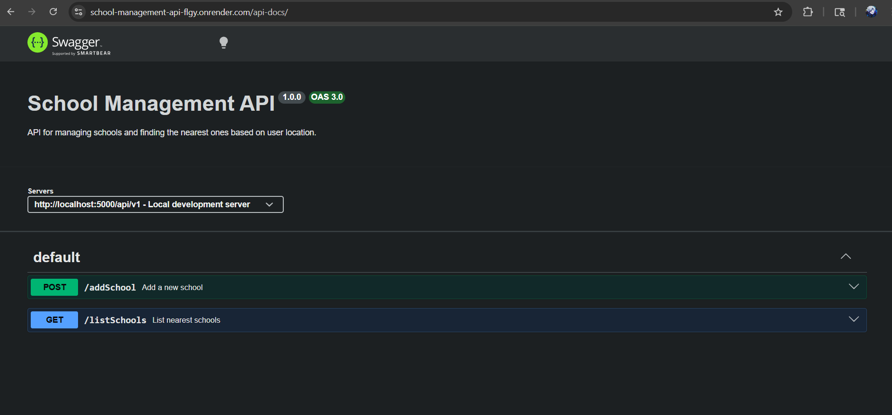
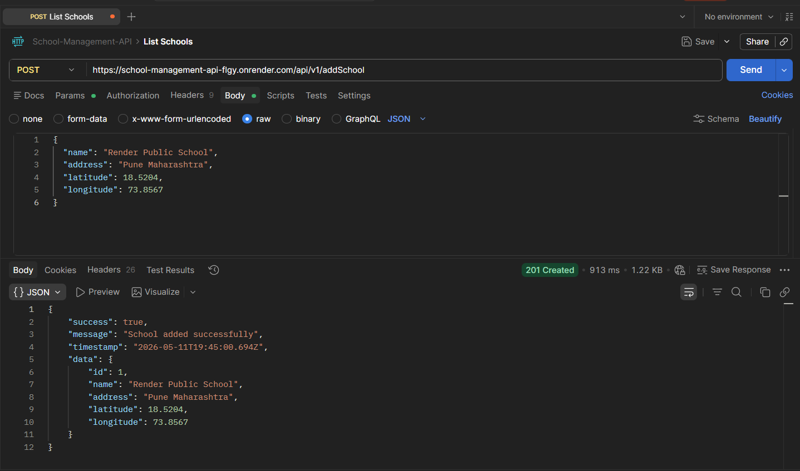
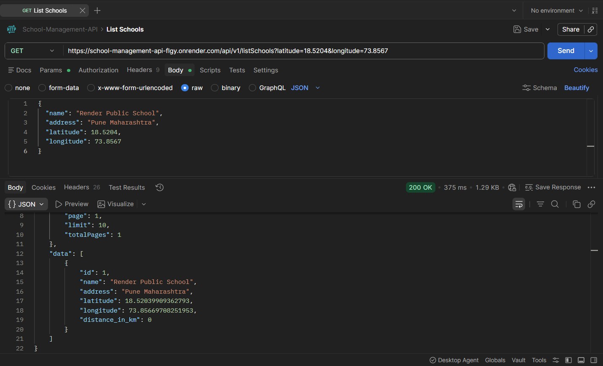

# School Management API System 🏫

[](https://nodejs.org/)
[](https://expressjs.com/)
[](https://www.mysql.com/)
[](https://swagger.io/)
[](https://render.com/)

The School Management API System is a production-ready RESTful service built with Node.js, Express.js, and MySQL. This API enables client applications to securely store school facility data and retrieve intelligent, geolocation-based facility lists sorted by proximity to any given set of geographic coordinates.

---

## 🌐 Live Application Links

- **Live API Base URL**: [https://school-management-api-flgy.onrender.com](https://school-management-api-flgy.onrender.com)
- **Interactive API Documentation (Swagger)**: [https://school-management-api-flgy.onrender.com/api-docs](https://school-management-api-flgy.onrender.com/api-docs)

---

## 📌 Project Overview
The School Management API System addresses a common geolocation requirement: identifying the nearest facilities. It provides robust endpoints to persist school data (including latitude and longitude coordinates) into a relational database and to retrieve these records dynamically. The system calculates real-time distances utilizing the mathematical Haversine formula to ensure accurate geospatial sorting.

## 🚀 Key Capabilities
- **Facility Registration**: Secure endpoint to insert new school records with comprehensive input validation and duplicate prevention logic.
- **Geospatial Sorting**: Dynamically calculates real-time distances between user coordinates and stored facilities to ensure optimal sorting.
- **Advanced Querying**: Supports standard pagination (`page`, `limit`), case-insensitive name searching, and dynamic radius filtering.
- **Robust Architecture**: Built upon the Model-View-Controller (MVC) architectural pattern with a highly modular folder structure.
- **Security & Reliability**: Incorporates Helmet for HTTP header security, CORS configuration, Morgan for request logging, and centralized global error handling.

## 🛠️ Technology Stack
- **Backend Environment:** Node.js
- **Web Framework:** Express.js
- **Database:** MySQL (Hosted on Railway)
- **Deployment Platform:** Render
- **Libraries:** mysql2, dotenv, cors, express-validator, helmet, morgan, swagger-ui-express

---

## 📸 Screenshots

### Swagger Documentation
The fully interactive Swagger UI interface where endpoints can be securely tested.


### Add School API (Postman)
Successfully registering a new school payload via Postman.


### List Schools API (Postman)
Fetching and dynamically sorting all facilities based on the provided user coordinates.


---

## 📁 Architecture Overview

```text
school-management-api/
├── config/             # Database connection pooling and environmental configuration
├── controllers/        # Core business logic for all API endpoints
├── database/           # SQL schema definitions for table creation
├── images/             # Documentation screenshots
├── middleware/         # Centralized error handling and request validation layers
├── postman/            # Exported Postman collection targeting the live production URL
├── routes/             # API routing definitions
├── utils/              # Shared utilities (constants, Haversine calculator, response formatter)
├── .env                # Environment-specific variables
├── package.json        # Project metadata and dependency manifest
├── server.js           # Main application entry point and server bootstrap
└── swagger.yaml        # OpenAPI/Swagger specification
```

---

## 💻 Installation & Local Setup Instructions

### 1. System Requirements
- Node.js runtime environment installed on the host machine.
- Local MySQL server or an external remote database (e.g., Railway).

### 2. Initialization Commands
Execute the following commands in the terminal to initialize the service locally:
```bash
# Clone the repository and navigate to the project directory
cd school-management-api

# Install all required dependencies
npm install

# Start the application in development mode
npm run dev
```

### 3. Environment Configuration
Create a `.env` file in the project root directory containing the following configuration keys:
```env
PORT=5000
DB_HOST=viaduct.proxy.rlwy.net
DB_PORT=53960
DB_USER=root
DB_PASSWORD=your_secure_password
DB_NAME=railway
```

---

## 🔌 API Endpoints & Specifications

### 1. Add School Endpoint
- **Endpoint:** `POST /api/v1/addSchool`
- **Description:** Persists a new school record to the database. Requires exact coordinates.
- **Request Payload:**
```json
{
  "name": "Delhi Public School",
  "address": "Pune Maharashtra",
  "latitude": 18.5204,
  "longitude": 73.8567
}
```

### 2. List Schools Endpoint
- **Endpoint:** `GET /api/v1/listSchools`
- **Query Parameters:** `latitude` (required), `longitude` (required), `page` (optional), `limit` (optional), `name` (optional), `radius` (optional)
- **Example Request:** `GET /api/v1/listSchools?latitude=18.5204&longitude=73.8567&page=1&limit=5`

---

## 🔍 Implementation & System Logic Explained

### 1. Distance Calculation Algorithm (Haversine Formula)
Because the Earth is a sphere, simple geometric equations cannot accurately determine geographical distance. The system implements the **Haversine formula** to determine the "great-circle" distance between two coordinate pairs. The algorithm converts decimal degrees to radians and applies the formula against the Earth's radius (6371 km) to yield precise distances in kilometers. This logic is strictly encapsulated within the `utils/distanceCalculator.js` utility module.

### 2. Validation Subsystem
The application heavily utilizes `express-validator` to intercept malformed data payloads before they ever reach the controller or database layers. The validation middleware strictly ensures:
- Both `latitude` (-90 to 90) and `longitude` (-180 to 180) exist within realistic geographical boundaries.
- String payloads (such as `name` and `address`) are automatically trimmed and verified for emptiness.

### 3. Data Filtering & Pagination Workflow
- **Search Protocol**: Queries containing the `name` parameter utilize the SQL `LIKE` operator to perform partial string matching (`%keyword%`).
- **Radius Filtering**: Following the extraction of records and calculation of relative distances, the application applies an in-memory filter to instantly exclude any facilities falling outside the user-requested maximum `radius`.
- **Pagination Logic**: After the data set is securely sorted by ascending distance, the system calculates standard `startIndex` and `endIndex` boundaries based on the requested `page` and `limit` parameters to deliver precisely formatted data chunks, alongside comprehensive pagination metadata (`total`, `totalPages`, etc).

### 4. Global Error Handling
The application replaces standard Express crash traces with a centralized error handling middleware (`middleware/errorMiddleware.js`). Any thrown exceptions or database failures are captured globally, standardized into the exact same JSON format as successful responses (`success`, `message`, `errors`), and delivered safely to the client. This guarantees clients always receive predictable, parseable data rather than raw HTML traces.

### 5. Production Deployment Architecture
The system operates seamlessly across a distributed cloud environment:
- **Application Host (Render)**: The Node.js application is deployed as a Web Service on Render, securely retrieving environment secrets at runtime and exposing a public HTTPS URL.
- **Database Host (Railway)**: The MySQL relational database is provisioned on Railway. The application specifically utilizes `mysql2`'s connection pooling alongside injected `DB_PORT` handling and `rejectUnauthorized: false` SSL configurations to successfully bypass strict cloud connectivity firewalls.

---

## 📬 API Testing with Postman

A complete Postman collection is included for easy API testing and evaluation.

Collection File:
postman/School-Management-API.postman_collection.json

The collection contains pre-configured requests for:
- Health Check Endpoint
- Add School Endpoint
- List Schools Endpoint

### Steps to Import
1. Open Postman
2. Click on Import
3. Choose the exported collection JSON file
4. Run the APIs directly

### Live API Base URL
https://school-management-api-flgy.onrender.com

---

## 🛠️ Troubleshooting & Issue Resolution

If an issue is encountered while running or testing the API locally, refer to the following common scenarios:

### 1. Database Connection Failure (`ECONNREFUSED` or Access Denied)
- **Symptom:** The terminal outputs a `Failed to connect to the database` error during startup.
- **Action Required:**
  - Verify that the target MySQL service is actively running and remotely accessible.
  - Cross-reference the credentials defined in the `.env` file (`DB_PORT`, `DB_PASSWORD`, `DB_HOST`, `DB_NAME`) against the Railway configuration.

### 2. Request Rejection: Validation Failed (400 Bad Request)
- **Symptom:** The API rejects the payload with a `Validation failed` message and an array of specific errors.
- **Action Required:**
  - Ensure the `Content-Type` header is strictly set to `application/json` in your testing client. Verify that the coordinates strictly fall within valid geographic numerical boundaries.

### 3. Data Conflict: Duplicate Resource (409 Conflict)
- **Symptom:** Attempting to add a school returns a `409 Conflict` stating the school already exists.
- **Action Required:**
  - The API prevents the creation of duplicate records based on exact coordinate and name matching logic. To proceed, slightly alter the coordinates or the name of the facility in the JSON payload.

---

## 🔮 Roadmap & Enhancements
- Implementation of robust Redis caching layers to drastically optimize latency on high-frequency geospatial queries.
- Integration of secure JWT-based authorization guardrails for administrative `POST` operations.
- Development of a cohesive, reactive frontend client interface using modern frameworks such as Next.js or React.
